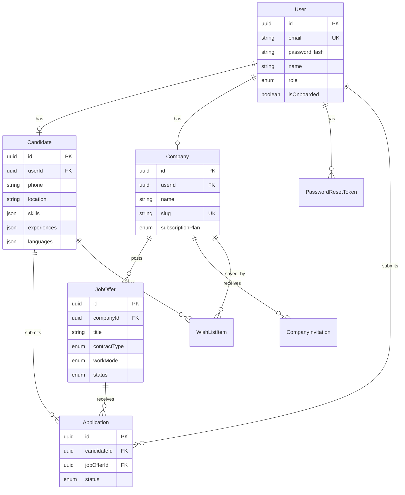
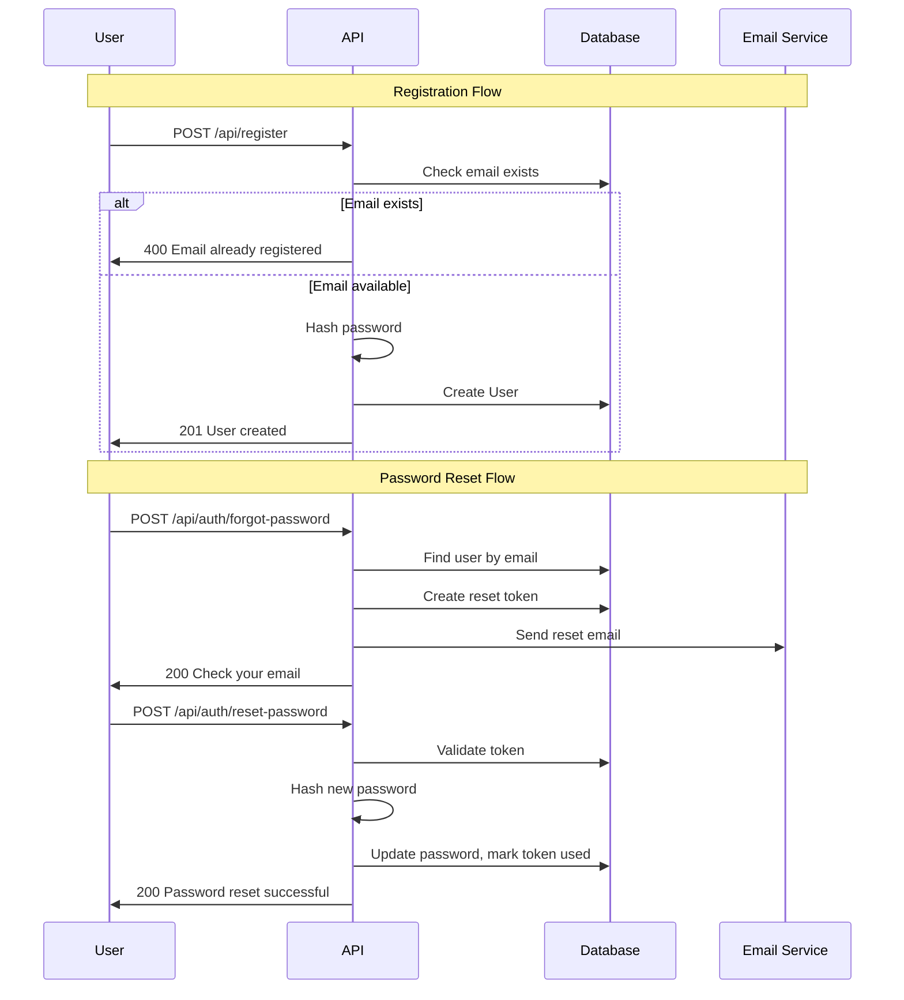
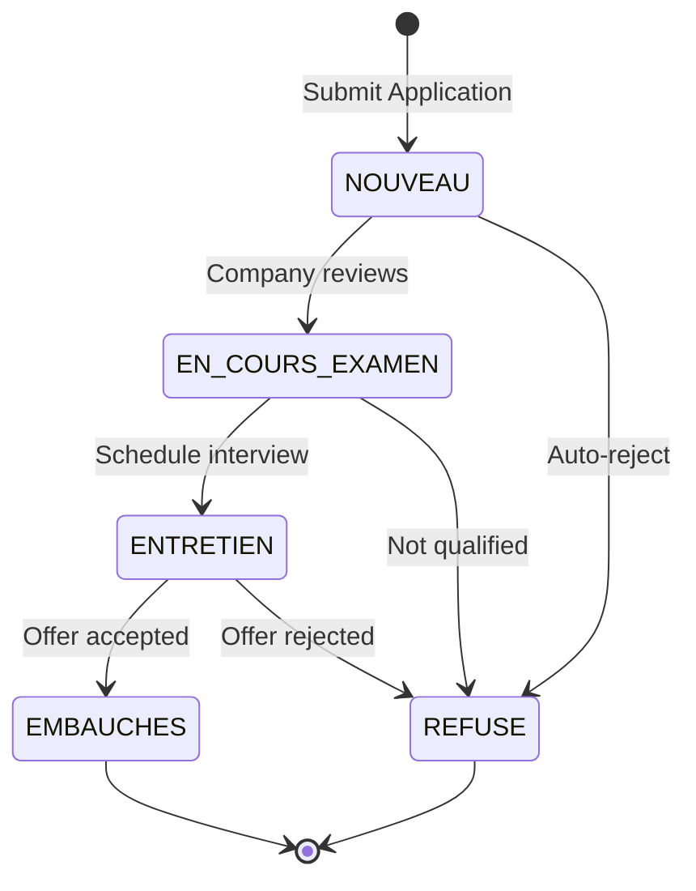

# cxJobs Backend Implementation Plan

## Project Overview

A call center recruitment platform backend for Tunisia, handling user authentication, job offers, applications, company management, and AI-powered job generation.

---

## Architecture Overview

```mermaid
graph TB
    subgraph Client
        WEB[Web Frontend]
        MOBILE[Mobile App]
    end

    subgraph API Layer
        AUTH[Auth Routes]
        USER[User Routes]
        JOB[Job Routes]
        APP[Application Routes]
        ADMIN[Admin Routes]
        BLOG[Blog Routes]
    end

    subgraph Services
        AUTHS[Auth Service]
        JOBS[Job Service]
        AIS[AI Service - GPT-4o]
        CVS[CV Parser Service]
        MAIL[Email Service]
    end

    subgraph Data Layer
        PRISMA[Prisma Client]
        DB[(PostgreSQL - Supabase)]
    end

    WEB --> API Layer
    MOBILE --> API Layer
    AUTH --> AUTHS
    USER --> AUTHS
    JOB --> JOBS
    APP --> JOBS
    ADMIN --> AUTHS
    BLOG --> PRISMA
    AUTHS --> PRISMA
    JOBS --> PRISMA
    AIS --> JOBS
    CVS --> JOBS
    MAIL --> AUTHS
    PRISMA --> DB
```

---

## Phase 1: Project Setup & Dependencies

### 1.1 Install Required Dependencies

```bash
# Authentication
npm install next-auth@beta bcryptjs jsonwebtoken
npm install -D @types/bcryptjs @types/jsonwebtoken

# Validation
npm install zod

# File Upload & Parsing
npm install multer pdf-parse formidable
npm install -D @types/multer @types/formidable

# AI Integration
npm install openai

# Email
npm install nodemailer
npm install -D @types/nodemailer

# Environment & Config
npm install dotenv

# Utilities
npm install date-fns
```

### 1.2 Project Structure

```
cxjobs/
├── app/
│   ├── api/
│   │   ├── auth/
│   │   │   ├── forgot-password/route.ts
│   │   │   ├── reset-password/route.ts
│   │   │   └── register/route.ts
│   │   ├── profile/
│   │   │   ├── route.ts
│   │   │   └── [role]/[id]/route.ts
│   │   ├── job-offers/
│   │   │   ├── route.ts
│   │   │   ├── [jobId]/route.ts
│   │   │   ├── [jobId]/applications/route.ts
│   │   │   └── generate-with-ai/route.ts
│   │   ├── application/
│   │   │   ├── route.ts
│   │   │   └── [id]/route.ts
│   │   ├── dashboard/
│   │   │   ├── candidate/route.ts
│   │   │   └── company/route.ts
│   │   ├── wishList/
│   │   │   └── route.ts
│   │   ├── admin/
│   │   │   ├── users/route.ts
│   │   │   ├── invitation/route.ts
│   │   │   └── validate/route.ts
│   │   ├── onboarding/
│   │   │   ├── route.ts
│   │   │   └── cvParse/route.ts
│   │   ├── blogs/
│   │   │   ├── route.ts
│   │   │   └── [id]/route.ts
│   │   └── stats/route.ts
│   └── page.tsx
├── lib/
│   ├── prisma.ts
│   ├── auth.ts
│   ├── validations/
│   │   ├── auth.ts
│   │   ├── job.ts
│   │   ├── application.ts
│   │   └── user.ts
│   └── utils/
│       ├── response.ts
│       └── password.ts
├── services/
│   ├── ai-service.ts
│   ├── email-service.ts
│   └── cv-parser-service.ts
├── types/
│   └── index.ts
└── prisma/
    └── schema.prisma
```

---

## Phase 2: Database Schema Design

### 2.1 Complete Prisma Schema

```prisma
generator client {
  provider = "prisma-client-js"
}

datasource db {
  provider = "postgresql"
}

// ==================== USER MANAGEMENT ====================

model User {
  id            String    @id @default(uuid())
  email         String    @unique
  passwordHash  String
  name          String
  role          UserRole  @default(CANDIDATE)
  isOnboarded   Boolean   @default(false)
  createdAt     DateTime  @default(now())
  updatedAt     DateTime  @updatedAt

  // Relations
  candidate     Candidate?
  company       Company?
  applications  Application[]
  passwordReset PasswordResetToken[]

  @@map("users")
}

enum UserRole {
  CANDIDATE
  COMPANY
  ADMIN
}

model PasswordResetToken {
  id        String   @id @default(uuid())
  token     String   @unique
  userId    String
  user      User     @relation(fields: [userId], references: [id], onDelete: Cascade)
  expiresAt DateTime
  used      Boolean  @default(false)
  createdAt DateTime @default(now())

  @@map("password_reset_tokens")
}

// ==================== PROFILES ====================

model Candidate {
  id          String   @id @default(uuid())
  userId      String   @unique
  user        User     @relation(fields: [userId], references: [id], onDelete: Cascade)
  phone       String?
  location    String?
  title       String?   // Professional title
  bio         String?
  skills      Json?     // Array of strings
  experiences Json?     // Array of experience objects
  languages   Json?     // Array of language objects with level
  education   Json?     // Array of education objects
  cvUrl       String?
  avatarUrl   String?
  createdAt   DateTime  @default(now())
  updatedAt   DateTime  @updatedAt

  // Relations
  applications  Application[]
  wishList      WishListItem[]

  @@map("candidates")
}

model Company {
  id               String           @id @default(uuid())
  userId           String           @unique
  user             User             @relation(fields: [userId], references: [id], onDelete: Cascade)
  name             String
  slug             String           @unique
  description      String?
  logoUrl          String?
  website          String?
  industry         String?
  companySize      String?
  location         String?
  subscriptionPlan SubscriptionPlan @default(ESSENTIAL)
  createdAt        DateTime         @default(now())
  updatedAt        DateTime         @updatedAt

  // Relations
  jobOffers        JobOffer[]
  invitations      CompanyInvitation[]

  @@map("companies")
}

enum SubscriptionPlan {
  ESSENTIAL
  GROW
  PREMIUM
}

// ==================== JOB MANAGEMENT ====================

model JobOffer {
  id             String       @id @default(uuid())
  companyId      String
  company        Company      @relation(fields: [companyId], references: [id], onDelete: Cascade)
  title          String
  slug           String       @unique
  description    String       @db.Text
  location       String
  contractType   ContractType
  workMode       WorkMode
  salary         String?
  salaryMin      Int?
  salaryMax      Int?
  requirements   Json?        // Array of requirements
  benefits       Json?        // Array of benefits
  status         JobStatus    @default(DRAFT)
  expirationDate DateTime?
  publishedAt    DateTime?
  createdAt      DateTime     @default(now())
  updatedAt      DateTime     @updatedAt

  // Relations
  applications   Application[]

  @@index([companyId])
  @@index([status])
  @@index([location])
  @@map("job_offers")
}

enum ContractType {
  CDI
  CDD
  FREELANCE
  INTERNSHIP
  PART_TIME
}

enum WorkMode {
  ON_SITE
  REMOTE
  HYBRID
}

enum JobStatus {
  DRAFT
  PUBLISHED
  ARCHIVED
  EXPIRED
}

// ==================== APPLICATIONS ====================

model Application {
  id           String           @id @default(uuid())
  candidateId  String
  candidate    Candidate        @relation(fields: [candidateId], references: [id], onDelete: Cascade)
  jobOfferId   String
  jobOffer     JobOffer         @relation(fields: [jobOfferId], references: [id], onDelete: Cascade)
  coverLetter  String?          @db.Text
  cvUrl        String?
  status       ApplicationStatus @default(NOUVEAU)
  notes        String?          @db.Text
  createdAt    DateTime         @default(now())
  updatedAt    DateTime         @updatedAt

  @@unique([candidateId, jobOfferId])
  @@index([candidateId])
  @@index([jobOfferId])
  @@index([status])
  @@map("applications")
}

enum ApplicationStatus {
  NOUVEAU
  EN_COURS_EXAMEN
  ENTRETIEN
  EMBAUCHES
  REFUSE
}

// ==================== COMPANY INVITATIONS ====================

model CompanyInvitation {
  id        String   @id @default(uuid())
  email     String
  token     String   @unique
  companyId String?
  company   Company? @relation(fields: [companyId], references: [id], onDelete: Cascade)
  used      Boolean  @default(false)
  expiresAt DateTime
  createdAt DateTime @default(now())

  @@map("company_invitations")
}

// ==================== WISHLIST ====================

model WishListItem {
  id          String   @id @default(uuid())
  candidateId String
  candidate   Candidate @relation(fields: [candidateId], references: [id], onDelete: Cascade)
  companyId   String
  company     Company   @relation(fields: [companyId], references: [id], onDelete: Cascade)
  createdAt   DateTime  @default(now())

  @@unique([candidateId, companyId])
  @@map("wish_list_items")
}

// ==================== BLOG ====================

model Blog {
  id          String   @id @default(uuid())
  title       String
  slug        String   @unique
  content     String   @db.Text
  excerpt     String?
  coverImage  String?
  authorId    String?
  published   Boolean  @default(false)
  publishedAt DateTime?
  views       Int      @default(0)
  tags        Json?
  createdAt   DateTime @default(now())
  updatedAt   DateTime @updatedAt

  @@map("blogs")
}
```

### 2.2 Entity Relationship Diagram



---

## Phase 3: Authentication System

### 3.1 Auth Configuration

- NextAuth.js v5 with credentials provider
- JWT session strategy
- Password hashing with bcrypt
- Password reset via email tokens

### 3.2 Auth Flow



---

## Phase 4: Core API Routes Implementation

### 4.1 Authentication Routes

| Route | Method | Description | Auth Required |
|-------|--------|-------------|---------------|
| `/api/auth/register` | POST | Register new user | No |
| `/api/auth/forgot-password` | POST | Request password reset | No |
| `/api/auth/reset-password` | POST | Reset password with token | No |

### 4.2 User/Profile Routes

| Route | Method | Description | Auth Required |
|-------|--------|-------------|---------------|
| `/api/profile` | GET | Get current user profile | Yes |
| `/api/profile` | POST | Create/update profile | Yes |
| `/api/profile/[role]/[id]` | GET | Get profile by role and ID | Yes |
| `/api/profile/[role]/[id]` | PUT | Update profile by role and ID | Yes |
| `/api/profile/allCompanies` | GET | List all companies | No |

### 4.3 Job Offer Routes

| Route | Method | Description | Auth Required |
|-------|--------|-------------|---------------|
| `/api/job-offers` | GET | List job offers with filters | No |
| `/api/job-offers` | POST | Create job offer | Company |
| `/api/job-offers/[jobId]` | GET | Get single job offer | No |
| `/api/job-offers/[jobId]` | PUT | Update job offer | Company Owner |
| `/api/job-offers/[jobId]` | DELETE | Delete job offer | Company Owner |
| `/api/job-offers/[jobId]/applications` | GET | Get applications for job | Company Owner |
| `/api/job-offers/generate-with-ai` | POST | Generate job with AI | Company |

### 4.4 Application Routes

| Route | Method | Description | Auth Required |
|-------|--------|-------------|---------------|
| `/api/application` | GET | List applications | Yes - role filtered |
| `/api/application` | POST | Submit application | Candidate |
| `/api/application/[id]` | GET | Get single application | Owner or Company |
| `/api/application/[id]` | PUT | Update application status | Company |

### 4.5 Dashboard Routes

| Route | Method | Description | Auth Required |
|-------|--------|-------------|---------------|
| `/api/dashboard/candidate` | GET | Candidate dashboard data | Candidate |
| `/api/dashboard/company` | GET | Company dashboard data | Company |

### 4.6 Admin Routes

| Route | Method | Description | Auth Required |
|-------|--------|-------------|---------------|
| `/api/admin/users` | GET | List all users | Admin |
| `/api/admin/users` | POST | Create user | Admin |
| `/api/admin/invitation` | GET | List invitations | Admin |
| `/api/admin/invitation` | POST | Create invitation | Admin |
| `/api/admin/validate` | GET | Validate invitation token | No |

### 4.7 Other Routes

| Route | Method | Description | Auth Required |
|-------|--------|-------------|---------------|
| `/api/wishList` | GET | Get candidates wishlist | Candidate |
| `/api/wishList` | POST | Add to wishlist | Candidate |
| `/api/wishList` | DELETE | Remove from wishlist | Candidate |
| `/api/onboarding` | POST | Complete onboarding | Yes |
| `/api/onboarding/cvParse` | POST | Parse CV file | Yes |
| `/api/blogs` | GET | List blogs | No |
| `/api/blogs` | POST | Create blog | Admin |
| `/api/blogs/[id]` | GET/PUT/DELETE | Blog CRUD | Admin for write |
| `/api/blogs/[id]/views` | POST | Increment views | No |
| `/api/stats` | GET | Platform statistics | Admin |

---

## Phase 5: Business Logic & Services

### 5.1 AI Service - Job Generation

```typescript
// services/ai-service.ts
// Uses OpenAI GPT-4o to generate:
// - Job descriptions in French
// - Salary benchmarks in TND
// - Required skills and qualifications
// - Benefits suggestions
```

### 5.2 CV Parser Service

```typescript
// services/cv-parser-service.ts
// Extracts from PDF:
// - Contact information
// - Skills
// - Work experience
// - Education
// - Languages
```

### 5.3 Email Service

```typescript
// services/email-service.ts
// Handles:
// - Password reset emails
// - Application notifications
// - Company invitations
```

### 5.4 Application Workflow



---

## Phase 6: Validation Schemas

### 6.1 Zod Schemas

```typescript
// lib/validations/auth.ts
const registerSchema = z.object({
  email: z.string().email(),
  password: z.string().min(8),
  name: z.string().min(2),
  role: z.enum(['CANDIDATE', 'COMPANY'])
});

// lib/validations/job.ts
const jobOfferSchema = z.object({
  title: z.string().min(5).max(100),
  location: z.string().min(2),
  contractType: z.enum(['CDI', 'CDD', 'FREELANCE', 'INTERNSHIP', 'PART_TIME']),
  workMode: z.enum(['ON_SITE', 'REMOTE', 'HYBRID']),
  description: z.string().min(50),
  salary: z.string().optional(),
  requirements: z.array(z.string()).optional(),
  expirationDate: z.string().datetime().optional()
});

// lib/validations/application.ts
const applicationSchema = z.object({
  jobOfferId: z.string().uuid(),
  coverLetter: z.string().max(5000).optional(),
  cvUrl: z.string().url().optional()
});
```

---

## Implementation Order

1. **Setup & Configuration**
   - Install dependencies
   - Configure environment variables
   - Setup Prisma client singleton

2. **Database Layer**
   - Complete Prisma schema
   - Run migrations
   - Create seed data

3. **Authentication**
   - Setup NextAuth.js
   - Implement password hashing
   - Create password reset flow

4. **Core API Routes**
   - User/Profile routes
   - Job Offer routes
   - Application routes

5. **Dashboard & Admin**
   - Dashboard routes
   - Admin routes
   - Statistics

6. **Services Integration**
   - AI job generation
   - CV parsing
   - Email notifications

7. **Additional Features**
   - Blog system
   - Wishlist
   - Onboarding

---

## Environment Variables Required

```env
# Database
DATABASE_URL="postgresql://..."
DIRECT_URL="postgresql://..."

# NextAuth
NEXTAUTH_SECRET="your-secret-key"
NEXTAUTH_URL="http://localhost:3000"

# OpenAI
OPENAI_API_KEY="sk-..."

# Email (SMTP)
SMTP_HOST="smtp.example.com"
SMTP_PORT="587"
SMTP_USER="your-email"
SMTP_PASS="your-password"

# Application
NEXT_PUBLIC_APP_URL="http://localhost:3000"
```

---

## Questions for Clarification

1. **Email Provider**: Which email service should be used for sending emails (SendGrid, Resend, SMTP)?

2. **File Storage**: Where should CV files and company logos be stored (local, S3, Supabase Storage)?

3. **AI Provider**: Confirm OpenAI GPT-4o for job generation, or alternative?

4. **Rate Limiting**: Should API rate limiting be implemented?

5. **Multi-language**: Should the API support multiple languages or French only?

---

## Next Steps

Once this plan is approved:
1. Switch to Code mode
2. Implement Phase 1: Project Setup
3. Continue through remaining phases
