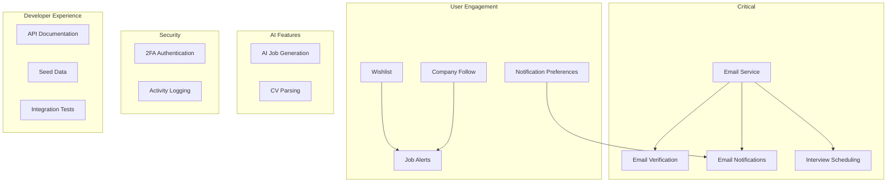

# CXJobs Feature Analysis & Enhancement Roadmap

## Executive Summary

This document provides a comprehensive analysis of the CXJobs platform's current implementation status and identifies potential features that could be added to enhance the platform.

---

## Current Implementation Status

### ✅ Fully Implemented Features

| Feature | Description | Location |
|---------|-------------|----------|
| User Authentication | NextAuth v5 with credentials & Google OAuth | [`lib/auth.ts`](lib/auth.ts), [`app/api/auth/`](app/api/auth) |
| Role-Based Access | CANDIDATE, COMPANY, ADMIN roles | [`prisma/schema.prisma`](prisma/schema.prisma:47) |
| Candidate Profiles | Skills, experiences, languages, education | [`prisma/schema.prisma`](prisma/schema.prisma:110) |
| Company Profiles | Company details, subscription plans | [`prisma/schema.prisma`](prisma/schema.prisma:207) |
| Job Offers CRUD | Full job management with status workflow | [`app/api/job-offers/`](app/api/job-offers/route.ts) |
| Applications System | Application submission and status tracking | [`app/api/application/`](app/api/application/route.ts) |
| In-App Notifications | Notification creation and management | [`lib/notifications.ts`](lib/notifications.ts), [`app/api/notifications/`](app/api/notifications/route.ts) |
| File Upload | Supabase Storage integration | [`app/api/upload/route.ts`](app/api/upload/route.ts), [`lib/supabase.ts`](lib/supabase.ts) |
| Rate Limiting | In-memory rate limiting | [`lib/rate-limit.ts`](lib/rate-limit.ts) |
| Caching Layer | Next.js cache with revalidation | [`lib/cache.ts`](lib/cache.ts) |
| Blog System | Blog posts with views tracking | [`app/api/blogs/`](app/api/blogs/route.ts) |
| Dashboard APIs | Candidate and company dashboards | [`app/api/dashboard/`](app/api/dashboard) |
| Admin APIs | User management, invitations, validation | [`app/api/admin/`](app/api/admin) |
| Password Reset | Token-based password reset flow | [`app/api/auth/forgot-password/route.ts`](app/api/auth/forgot-password/route.ts) |

### ⚠️ Partially Implemented Features

| Feature | Status | Missing Parts |
|---------|--------|---------------|
| Email Service | TODO comments exist | Actual email sending implementation |
| Notifications | In-app only | Email notifications, preferences, real-time |
| Job Recommendations | Basic skill matching | ML-based matching, alerts |

---

## Proposed Feature Enhancements

### 🔴 Priority 1: Critical Missing Features

#### 1. Email Service Implementation
**Current State:** Password reset and invitation routes have TODO comments for email sending.

**Required Actions:**
- Install email provider SDK (Resend, SendGrid, or Nodemailer)
- Create [`lib/email.ts`](lib/email.ts) with template support
- Implement email templates for:
  - Password reset emails
  - Company invitation emails
  - Welcome emails
  - Application notifications
  - Interview scheduling

**Files to Create/Modify:**
```
lib/email.ts                    # Email service
lib/templates/emails/           # Email templates
app/api/auth/forgot-password/   # Add email sending
app/api/admin/invitation/       # Add email sending
```

#### 2. Email Verification
**Current State:** Users can register without verifying email.

**Required Actions:**
- Add `emailVerified` field usage in registration flow
- Create email verification endpoint
- Send verification email on registration
- Block certain actions until verified

**Files to Create:**
```
app/api/auth/verify-email/route.ts
```

#### 3. Wishlist/Saved Jobs
**Current State:** Mentioned in original plan but not implemented.

**Required Actions:**
- Add WishlistItem model to schema (candidate can save jobs)
- Create wishlist API endpoints
- Add to candidate dashboard

**Schema Addition:**
```prisma
model WishlistItem {
  id          String   @id @default(uuid())
  candidateId String
  candidate   Candidate @relation(fields: [candidateId], references: [id], onDelete: Cascade)
  jobOfferId  String
  jobOffer    JobOffer  @relation(fields: [jobOfferId], references: [id], onDelete: Cascade)
  createdAt   DateTime  @default(now())

  @@unique([candidateId, jobOfferId])
  @@map("wishlist_items")
}
```

**Files to Create:**
```
app/api/wishlist/route.ts
app/api/wishlist/[jobId]/route.ts
```

---

### 🟡 Priority 2: Important Enhancements

#### 4. Notification Preferences System
**Current State:** Users cannot control notification settings.

**Required Actions:**
- Add NotificationPreference model
- Create preferences API
- Integrate with notification creation

**Schema Addition:**
```prisma
model NotificationPreference {
  id                       String  @id @default(uuid())
  userId                   String  @unique
  user                     User    @relation(fields: [userId], references: [id], onDelete: Cascade)
  emailEnabled             Boolean @default(true)
  emailApplicationUpdates  Boolean @default(true)
  emailJobMatches          Boolean @default(true)
  inAppEnabled             Boolean @default(true)
  createdAt                DateTime @default(now())
  updatedAt                DateTime @updatedAt

  @@map("notification_preferences")
}
```

**Files to Create:**
```
app/api/notifications/preferences/route.ts
```

#### 5. Interview Scheduling
**Current State:** Application status includes ENTRETIEN but no scheduling data.

**Required Actions:**
- Add Interview model with date, time, location, notes
- Create interview scheduling endpoints
- Send calendar invites
- Notify candidates

**Schema Addition:**
```prisma
model Interview {
  id             String   @id @default(uuid())
  applicationId  String   @unique
  application    Application @relation(fields: [applicationId], references: [id], onDelete: Cascade)
  scheduledAt    DateTime
  location       String?  // Physical location or meeting URL
  type           InterviewType
  notes          String?  @db.Text
  status         InterviewStatus @default(SCHEDULED)
  createdAt      DateTime @default(now())
  updatedAt      DateTime @updatedAt

  @@map("interviews")
}

enum InterviewType {
  PHONE
  VIDEO
  ON_SITE
}

enum InterviewStatus {
  SCHEDULED
  COMPLETED
  CANCELLED
  RESCHEDULED
}
```

**Files to Create:**
```
app/api/interviews/route.ts
app/api/interviews/[id]/route.ts
```

#### 6. Job Alerts & Subscriptions
**Current State:** No way for candidates to subscribe to job alerts.

**Required Actions:**
- Add JobAlert model for saved search criteria
- Create alert subscription endpoints
- Implement scheduled job to check and send alerts

**Schema Addition:**
```prisma
model JobAlert {
  id          String   @id @default(uuid())
  candidateId String
  candidate   Candidate @relation(fields: [candidateId], references: [id], onDelete: Cascade)
  keywords    String?
  location    String?
  contractType ContractType?
  workMode    WorkMode?
  frequency   AlertFrequency @default(DAILY)
  isActive    Boolean  @default(true)
  lastSentAt  DateTime?
  createdAt   DateTime @default(now())

  @@index([candidateId])
  @@map("job_alerts")
}

enum AlertFrequency {
  DAILY
  WEEKLY
}
```

**Files to Create:**
```
app/api/job-alerts/route.ts
app/api/job-alerts/[id]/route.ts
lib/cron/job-alerts.ts
```

#### 7. Company Following
**Current State:** Candidates cannot follow companies they're interested in.

**Required Actions:**
- Add CompanyFollow model
- Create follow/unfollow endpoints
- Show followed companies in dashboard

**Schema Addition:**
```prisma
model CompanyFollow {
  id          String   @id @default(uuid())
  candidateId String
  candidate   Candidate @relation(fields: [candidateId], references: [id], onDelete: Cascade)
  companyId   String
  company     Company   @relation(fields: [companyId], references: [id], onDelete: Cascade)
  createdAt   DateTime  @default(now())

  @@unique([candidateId, companyId])
  @@map("company_follows")
}
```

**Files to Create:**
```
app/api/company/follow/route.ts
app/api/company/follow/[companyId]/route.ts
```

---

### 🟢 Priority 3: Nice-to-Have Features

#### 8. AI-Powered Job Description Generation
**Current State:** Mentioned in original plan but not implemented.

**Required Actions:**
- Install OpenAI SDK
- Create AI service for job description generation
- Add endpoint for generating descriptions from title/requirements

**Files to Create:**
```
lib/ai-service.ts
app/api/job-offers/generate-with-ai/route.ts
```

#### 9. CV Parsing Service
**Current State:** Mentioned in original plan but not implemented.

**Required Actions:**
- Install PDF parsing library
- Create CV parser to extract skills, experience, education
- Auto-populate candidate profile from CV

**Files to Create:**
```
lib/cv-parser.ts
app/api/onboarding/cv-parse/route.ts
```

#### 10. Activity/Audit Logging
**Current State:** No tracking of user actions.

**Required Actions:**
- Add ActivityLog model
- Create logging middleware
- Build admin activity dashboard

**Schema Addition:**
```prisma
model ActivityLog {
  id        String   @id @default(uuid())
  userId    String?
  action    String
  entityType String
  entityId  String?
  metadata  Json?
  ipAddress String?
  createdAt DateTime @default(now())

  @@index([userId])
  @@index([action])
  @@index([createdAt])
  @@map("activity_logs")
}
```

**Files to Create:**
```
lib/activity-logger.ts
app/api/admin/activity-logs/route.ts
```

#### 11. Advanced Search & Filtering
**Current State:** Basic filtering exists but could be enhanced.

**Required Actions:**
- Add full-text search with PostgreSQL
- Implement faceted search for jobs
- Add search suggestions/autocomplete
- Save search history

**Files to Create:**
```
app/api/search/route.ts
app/api/search/suggestions/route.ts
```

#### 12. Two-Factor Authentication
**Current State:** Only password authentication.

**Required Actions:**
- Add 2FA fields to User model
- Implement TOTP (Time-based OTP)
- Create 2FA setup and verification endpoints

**Files to Create:**
```
app/api/auth/2fa/setup/route.ts
app/api/auth/2fa/verify/route.ts
```

#### 13. API Documentation (OpenAPI/Swagger)
**Current State:** Postman collection exists but no OpenAPI spec.

**Required Actions:**
- Install swagger-jsdoc and swagger-ui-react
- Add JSDoc comments to all endpoints
- Create documentation route

**Files to Create:**
```
app/api/docs/route.ts
lib/openapi.ts
```

#### 14. Seed Data Script
**Current State:** No seed data for development/testing.

**Required Actions:**
- Create comprehensive seed script
- Add sample users, companies, jobs, applications
- Add npm script for seeding

**Files to Create:**
```
prisma/seed.ts
```

#### 15. Integration Tests
**Current State:** No automated tests.

**Required Actions:**
- Install Vitest and testing utilities
- Create test setup
- Write tests for critical paths

**Files to Create:**
```
tests/setup.ts
tests/auth.test.ts
tests/jobs.test.ts
tests/applications.test.ts
```

---

## Feature Dependency Graph



---

## Implementation Phases

### Phase 1: Critical Infrastructure
1. Email Service Implementation
2. Email Verification
3. Wishlist/Saved Jobs

### Phase 2: User Engagement
4. Notification Preferences
5. Interview Scheduling
6. Job Alerts
7. Company Following

### Phase 3: Advanced Features
8. AI Job Description Generation
9. CV Parsing Service
10. Activity Logging
11. Advanced Search

### Phase 4: Security & Polish
12. Two-Factor Authentication
13. API Documentation
14. Seed Data
15. Integration Tests

---

## Questions for Prioritization

1. **What is the target launch timeline?** This will help prioritize which features are essential vs. nice-to-have.

2. **Is email service already set up?** Do you have a preferred provider (Resend, SendGrid, AWS SES)?

3. **AI Features Priority?** Are AI-powered job generation and CV parsing important for the MVP?

4. **Mobile App Plans?** Will there be a mobile app? This affects features like push notifications and 2FA implementation.

5. **Compliance Requirements?** Are there any specific audit logging or data retention requirements?

6. **Multi-language Support?** Will the platform need to support multiple languages (French/Arabic for Tunisia)?

---

## Summary Statistics

| Category | Count |
|----------|-------|
| Fully Implemented Features | 14 |
| Partially Implemented Features | 3 |
| Priority 1 Features | 3 |
| Priority 2 Features | 4 |
| Priority 3 Features | 8 |
| **Total Proposed Features** | **15** |
