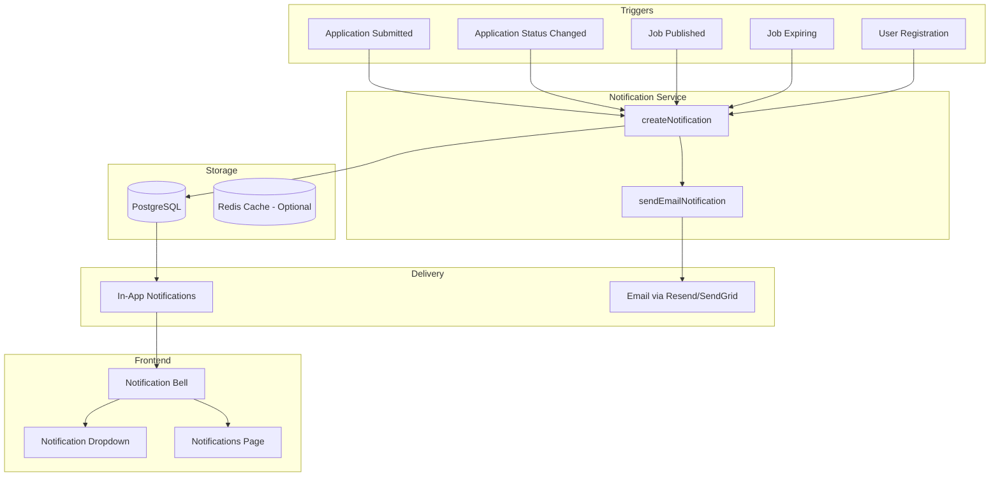

# Notifications System Architecture Plan

## Overview

This document outlines the architecture for implementing a full notifications system in the CXJobs platform. The system will support in-app notifications, email notifications, and provide a foundation for future push notifications.

## Current System Analysis

### Existing Models
- **User** - Base user with roles: CANDIDATE, COMPANY, ADMIN
- **Candidate** - Job seeker profile
- **Company** - Employer profile
- **JobOffer** - Job listings
- **Application** - Job applications with status tracking
- **Blog** - Blog posts

### Application Status Flow
```
NOUVEAU → EN_COURS_EXAMEN → ENTRETIEN → EMBAUCHES
                                    ↘ REFUSE
```

---

## Database Schema Design

### Notification Model

```prisma
model Notification {
  id          String             @id @default(uuid())
  userId      String             // Recipient user ID
  user        User               @relation(fields: [userId], references: [id], onDelete: Cascade)
  
  // Notification content
  type        NotificationType
  title       String
  message     String             @db.Text
  data        Json?              // Additional metadata (jobId, applicationId, etc.)
  
  // Status
  read        Boolean            @default(false)
  readAt      DateTime?
  
  // Delivery tracking
  emailSent   Boolean            @default(false)
  emailSentAt DateTime?
  
  // Timestamps
  createdAt   DateTime           @default(now())
  expiresAt   DateTime?          // Optional expiration for time-sensitive notifications
  
  @@index([userId])
  @@index([read])
  @@index([type])
  @@index([createdAt])
  @@map("notifications")
}

enum NotificationType {
  // Application notifications (for companies)
  NEW_APPLICATION
  
  // Application status notifications (for candidates)
  APPLICATION_VIEWED
  APPLICATION_STATUS_CHANGED
  INTERVIEW_SCHEDULED
  
  // Job notifications
  JOB_PUBLISHED
  JOB_EXPIRING
  JOB_EXPIRED
  
  // System notifications
  WELCOME
  PROFILE_INCOMPLETE
  PASSWORD_CHANGED
  EMAIL_VERIFICATION
  
  // Admin notifications
  NEW_COMPANY_REGISTERED
  NEW_CANDIDATE_REGISTERED
  
  // Marketing/Engagement
  JOB_RECOMMENDATION
  WEEKLY_DIGEST
}
```

### Notification Preferences Model

```prisma
model NotificationPreference {
  id                          String  @id @default(uuid())
  userId                      String  @unique
  user                        User    @relation(fields: [userId], references: [id], onDelete: Cascade)
  
  // Email preferences
  emailEnabled                Boolean @default(true)
  emailApplicationUpdates     Boolean @default(true)
  emailJobMatches             Boolean @default(true)
  emailMarketing              Boolean @default(false)
  emailWeeklyDigest           Boolean @default(true)
  
  // In-app preferences
  inAppEnabled                Boolean @default(true)
  inAppApplicationUpdates     Boolean @default(true)
  inAppJobMatches             Boolean @default(true)
  inAppSystemNotifications    Boolean @default(true)
  
  createdAt                   DateTime @default(now())
  updatedAt                   DateTime @updatedAt
  
  @@map("notification_preferences")
}
```

---

## Notification Events and Triggers

### 1. Application Events

| Event | Trigger | Recipient | Notification Type |
|-------|---------|-----------|-------------------|
| Application Submitted | Candidate applies to job | Company User | `NEW_APPLICATION` |
| Application Viewed | Company opens application | Candidate | `APPLICATION_VIEWED` |
| Status Changed | Company updates status | Candidate | `APPLICATION_STATUS_CHANGED` |
| Interview Scheduled | Company schedules interview | Candidate | `INTERVIEW_SCHEDULED` |

### 2. Job Events

| Event | Trigger | Recipient | Notification Type |
|-------|---------|-----------|-------------------|
| Job Published | Company publishes job | Matching Candidates | `JOB_PUBLISHED` |
| Job Expiring | 7 days before expiration | Company User | `JOB_EXPIRING` |
| Job Expired | Expiration date reached | Company User | `JOB_EXPIRED` |

### 3. System Events

| Event | Trigger | Recipient | Notification Type |
|-------|---------|-----------|-------------------|
| User Registration | New user signs up | User | `WELCOME` |
| Profile Incomplete | User has empty profile | User | `PROFILE_INCOMPLETE` |
| Password Changed | User updates password | User | `PASSWORD_CHANGED` |
| Email Verification | User registers | User | `EMAIL_VERIFICATION` |

### 4. Admin Events

| Event | Trigger | Recipient | Notification Type |
|-------|---------|-----------|-------------------|
| New Company | Company registers | All Admins | `NEW_COMPANY_REGISTERED` |
| New Candidate | Candidate registers | All Admins | `NEW_CANDIDATE_REGISTERED` |

---

## API Endpoints Design

### Notification Endpoints

```
GET    /api/notifications              # List user notifications (paginated)
GET    /api/notifications/unread-count # Get unread notification count
PATCH  /api/notifications/:id/read     # Mark single notification as read
PATCH  /api/notifications/read-all     # Mark all notifications as read
DELETE /api/notifications/:id          # Delete a notification
```

### Notification Preferences Endpoints

```
GET    /api/notifications/preferences  # Get user notification preferences
PATCH  /api/notifications/preferences  # Update notification preferences
```

---

## Architecture Diagram



---

## Implementation Phases

### Phase 1: Core Infrastructure
1. Add Notification and NotificationPreference models to Prisma schema
2. Create database migration
3. Create notification service library (`lib/notifications.ts`)
4. Create notification API endpoints

### Phase 2: In-App Notifications
1. Create notification bell component with unread count badge
2. Create notification dropdown component
3. Create notifications page with filtering
4. Implement real-time polling or WebSocket for live updates

### Phase 3: Email Notifications
1. Set up email provider (Resend recommended)
2. Create email templates
3. Implement email sending logic
4. Add email preference checks

### Phase 4: Integration
1. Integrate notification triggers into existing routes
2. Add notification triggers for application events
3. Add notification triggers for job events
4. Add notification triggers for system events

### Phase 5: Advanced Features
1. Notification digest (daily/weekly summary)
2. Job recommendation notifications
3. Push notifications (future)
4. SMS notifications (future)

---

## File Structure

```
lib/
├── notifications.ts              # Core notification service
├── email.ts                      # Email sending service
└── templates/
    └── emails/
        ├── application-received.tsx
        ├── status-update.tsx
        ├── interview-scheduled.tsx
        └── welcome.tsx

app/api/notifications/
├── route.ts                      # GET (list), POST (create - internal)
├── unread-count/route.ts         # GET unread count
├── read-all/route.ts             # PATCH mark all read
├── [id]/
│   ├── route.ts                  # GET, PATCH, DELETE single notification
│   └── read/route.ts             # PATCH mark as read
└── preferences/
    └── route.ts                  # GET, PATCH preferences

components/notifications/
├── notification-bell.tsx         # Bell icon with badge
├── notification-dropdown.tsx     # Dropdown list
├── notification-item.tsx         # Single notification card
└── notification-preferences.tsx  # Settings form
```

---

## Technical Considerations

### Performance
- Use database indexes on `userId`, `read`, `type`, and `createdAt`
- Implement pagination (max 50 per page)
- Cache unread count in Redis for high-traffic scenarios
- Batch email sending to avoid rate limits

### Security
- Validate user ownership before marking notifications as read
- Rate limit notification creation to prevent spam
- Sanitize notification content to prevent XSS

### Scalability
- Consider message queue (BullMQ/Redis) for high volume
- Implement notification archiving for old notifications
- Add notification grouping for similar events

---

## Questions for Clarification

1. **Email Provider**: Do you have a preference for email service? (Resend, SendGrid, AWS SES, etc.)

2. **Real-time Updates**: Do you want real-time notifications via WebSocket, or is polling acceptable?

3. **Notification Retention**: How long should notifications be kept before auto-deletion?

4. **Job Matching**: Should we implement job recommendation notifications based on candidate skills?

5. **Digest Emails**: Do you want daily/weekly digest emails summarizing notifications?

6. **Push Notifications**: Is this a future requirement for mobile apps?
