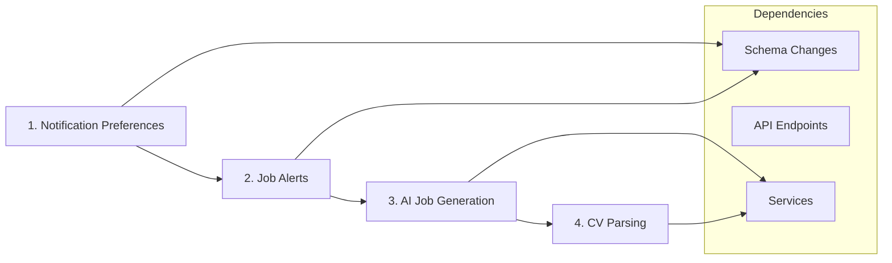

# Selected Features Implementation Plan

## Overview

This document outlines the detailed implementation plan for the 4 selected features:
1. Notification Preferences
2. Job Alerts & Subscriptions
3. AI Job Description Generation
4. CV Parsing Service

---

## Feature 1: Notification Preferences

### Description
Allow users to control their notification settings, including email and in-app notification preferences for different types of events.

### Database Schema Changes

```prisma
model NotificationPreference {
  id                       String  @id @default(uuid())
  userId                   String  @unique
  user                     User    @relation(fields: [userId], references: [id], onDelete: Cascade)
  
  // Email preferences
  emailEnabled             Boolean @default(true)
  emailApplicationUpdates  Boolean @default(true)
  emailJobMatches          Boolean @default(true)
  emailMarketing           Boolean @default(false)
  emailWeeklyDigest        Boolean @default(true)
  
  // In-app preferences
  inAppEnabled             Boolean @default(true)
  inAppApplicationUpdates  Boolean @default(true)
  inAppJobMatches          Boolean @default(true)
  inAppSystemNotifications Boolean @default(true)
  
  createdAt                DateTime @default(now())
  updatedAt                DateTime @updatedAt

  @@map("notification_preferences")
}
```

### API Endpoints

| Method | Endpoint | Description |
|--------|----------|-------------|
| GET | `/api/notifications/preferences` | Get user notification preferences |
| PATCH | `/api/notifications/preferences` | Update notification preferences |

### Files to Create/Modify

```
app/api/notifications/preferences/route.ts  # GET, PATCH endpoints
lib/validations/notifications.ts            # Zod schemas for preferences
```

### Implementation Steps

1. Add `NotificationPreference` model to [`prisma/schema.prisma`](prisma/schema.prisma)
2. Add relation to User model
3. Run Prisma migration
4. Create validation schemas in `lib/validations/notifications.ts`
5. Create API endpoints in `app/api/notifications/preferences/route.ts`
6. Update [`lib/notifications.ts`](lib/notifications.ts) to check preferences before sending

### Validation Schema

```typescript
// lib/validations/notifications.ts
import { z } from "zod";

export const notificationPreferencesSchema = z.object({
  emailEnabled: z.boolean().optional(),
  emailApplicationUpdates: z.boolean().optional(),
  emailJobMatches: z.boolean().optional(),
  emailMarketing: z.boolean().optional(),
  emailWeeklyDigest: z.boolean().optional(),
  inAppEnabled: z.boolean().optional(),
  inAppApplicationUpdates: z.boolean().optional(),
  inAppJobMatches: z.boolean().optional(),
  inAppSystemNotifications: z.boolean().optional(),
});
```

---

## Feature 2: Job Alerts & Subscriptions

### Description
Allow candidates to create job alerts based on search criteria (keywords, location, contract type, work mode) and receive notifications when matching jobs are posted.

### Database Schema Changes

```prisma
model JobAlert {
  id           String        @id @default(uuid())
  candidateId  String
  candidate    Candidate     @relation(fields: [candidateId], references: [id], onDelete: Cascade)
  
  // Search criteria
  name         String?       // User-defined alert name
  keywords     String?       // Comma-separated keywords
  location     String?
  contractType ContractType?
  workMode     WorkMode?
  salaryMin    Int?
  
  // Alert settings
  frequency    AlertFrequency @default(DAILY)
  isActive     Boolean        @default(true)
  lastSentAt   DateTime?
  
  createdAt    DateTime       @default(now())
  updatedAt    DateTime       @updatedAt

  @@index([candidateId])
  @@index([isActive])
  @@map("job_alerts")
}

enum AlertFrequency {
  DAILY
  WEEKLY
}
```

### API Endpoints

| Method | Endpoint | Description |
|--------|----------|-------------|
| GET | `/api/job-alerts` | List user job alerts |
| POST | `/api/job-alerts` | Create new job alert |
| GET | `/api/job-alerts/[id]` | Get specific alert |
| PATCH | `/api/job-alerts/[id]` | Update job alert |
| DELETE | `/api/job-alerts/[id]` | Delete job alert |
| POST | `/api/job-alerts/test` | Test alert for matching jobs |

### Files to Create

```
app/api/job-alerts/route.ts           # GET, POST endpoints
app/api/job-alerts/[id]/route.ts      # GET, PATCH, DELETE endpoints
lib/validations/job-alert.ts          # Zod schemas
lib/job-alert-service.ts              # Alert matching logic
```

### Implementation Steps

1. Add `JobAlert` model and `AlertFrequency` enum to schema
2. Add relation to Candidate model
3. Run Prisma migration
4. Create validation schemas
5. Create API endpoints
6. Create job alert service for matching logic
7. Add notification type `JOB_RECOMMENDATION` to NotificationType enum

### Job Alert Service Logic

```typescript
// lib/job-alert-service.ts
export async function findMatchingJobs(alert: JobAlert): Promise<JobOffer[]> {
  const where: Prisma.JobOfferWhereInput = {
    status: "PUBLISHED",
    deletedAt: null,
    createdAt: { gte: alert.lastSentAt || new Date(0) },
  };

  if (alert.keywords) {
    const keywords = alert.keywords.split(",").map(k => k.trim());
    where.OR = keywords.map(keyword => ({
      OR: [
        { title: { contains: keyword, mode: "insensitive" } },
        { description: { contains: keyword, mode: "insensitive" } },
      ]
    }));
  }

  if (alert.location) {
    where.location = { contains: alert.location, mode: "insensitive" };
  }

  if (alert.contractType) {
    where.contractType = alert.contractType;
  }

  if (alert.workMode) {
    where.workMode = alert.workMode;
  }

  if (alert.salaryMin) {
    where.salaryMin = { gte: alert.salaryMin };
  }

  return prisma.jobOffer.findMany({ where, include: { company: true } });
}
```

---

## Feature 3: AI Job Description Generation

### Description
Use OpenAI GPT-4 to generate professional job descriptions based on job title, requirements, and company information.

### Dependencies

```bash
npm install openai
```

### Environment Variables

```env
OPENAI_API_KEY="sk-..."
```

### API Endpoints

| Method | Endpoint | Description |
|--------|----------|-------------|
| POST | `/api/job-offers/generate-with-ai` | Generate job description |

### Files to Create

```
lib/ai-service.ts                           # OpenAI integration
app/api/job-offers/generate-with-ai/route.ts # API endpoint
lib/validations/ai.ts                       # Validation schemas
```

### Implementation Steps

1. Install OpenAI SDK
2. Create AI service in `lib/ai-service.ts`
3. Create API endpoint
4. Add rate limiting for AI endpoint
5. Add validation schemas

### AI Service

```typescript
// lib/ai-service.ts
import OpenAI from "openai";

const openai = new OpenAI({
  apiKey: process.env.OPENAI_API_KEY,
});

export interface JobGenerationInput {
  title: string;
  company?: string;
  industry?: string;
  location?: string;
  contractType?: string;
  workMode?: string;
  requirements?: string[];
  benefits?: string[];
}

export async function generateJobDescription(input: JobGenerationInput): Promise<{
  description: string;
  requirements: string[];
  benefits: string[];
}> {
  const prompt = `Generate a professional job description for the following position:
    
Title: ${input.title}
Company: ${input.company || "A leading company"}
Industry: ${input.industry || "Not specified"}
Location: ${input.location || "Not specified"}
Contract Type: ${input.contractType || "Not specified"}
Work Mode: ${input.workMode || "Not specified"}

Please provide:
1. A compelling job description (2-3 paragraphs)
2. A list of 5-8 key requirements
3. A list of 4-6 benefits

Format the response as JSON with keys: description, requirements (array), benefits (array).`;

  const completion = await openai.chat.completions.create({
    model: "gpt-4o",
    messages: [{ role: "user", content: prompt }],
    response_format: { type: "json_object" },
  });

  const result = JSON.parse(completion.choices[0].message.content || "{}");
  
  return {
    description: result.description || "",
    requirements: result.requirements || [],
    benefits: result.benefits || [],
  };
}
```

### API Endpoint

```typescript
// app/api/job-offers/generate-with-ai/route.ts
import { NextRequest, NextResponse } from "next/server";
import { auth } from "@/lib/auth";
import { generateJobDescription } from "@/lib/ai-service";
import { jobGenerationSchema } from "@/lib/validations/ai";
import { rateLimitResponse, RATE_LIMIT_PRESETS } from "@/lib/rate-limit";
import { getClientIp } from "@/lib/utils";

export async function POST(request: NextRequest) {
  // Rate limiting (stricter for AI)
  const clientIp = getClientIp(request);
  const rateLimitResult = rateLimitResponse(clientIp, { 
    maxRequests: 10, 
    windowMs: 60 * 1000 
  });
  if (rateLimitResult) return rateLimitResult;

  const session = await auth();
  if (!session?.user?.id || session.user.role !== "COMPANY") {
    return NextResponse.json(
      { success: false, error: "Unauthorized", code: "UNAUTHORIZED" },
      { status: 401 }
    );
  }

  const body = await request.json();
  const validation = jobGenerationSchema.safeParse(body);
  if (!validation.success) {
    return NextResponse.json(
      { success: false, error: "Validation failed", details: validation.error.flatten() },
      { status: 400 }
    );
  }

  try {
    const result = await generateJobDescription(validation.data);
    return NextResponse.json({ success: true, data: result });
  } catch (error) {
    console.error("AI generation error:", error);
    return NextResponse.json(
      { success: false, error: "Failed to generate description", code: "AI_ERROR" },
      { status: 500 }
    );
  }
}
```

---

## Feature 4: CV Parsing Service

### Description
Parse uploaded CVs (PDF format) to automatically extract candidate information including skills, experience, education, and languages.

### Dependencies

```bash
npm install pdf-parse
npm install -D @types/pdf-parse
```

### API Endpoints

| Method | Endpoint | Description |
|--------|----------|-------------|
| POST | `/api/onboarding/cv-parse` | Parse CV and extract data |

### Files to Create

```
lib/cv-parser.ts                        # CV parsing logic
app/api/onboarding/cv-parse/route.ts    # API endpoint
```

### Implementation Steps

1. Install pdf-parse library
2. Create CV parser service
3. Create API endpoint
4. Integrate with AI for better extraction (optional enhancement)

### CV Parser Service

```typescript
// lib/cv-parser.ts
import pdf from "pdf-parse";

export interface ParsedCV {
  name?: string;
  email?: string;
  phone?: string;
  location?: string;
  title?: string;
  summary?: string;
  skills: string[];
  experiences: {
    title: string;
    company: string;
    location?: string;
    startDate?: string;
    endDate?: string;
    description?: string;
  }[];
  education: {
    institution: string;
    degree: string;
    field?: string;
    startDate?: string;
    endDate?: string;
  }[];
  languages: {
    name: string;
    level?: string;
  }[];
}

export async function parseCV(buffer: Buffer): Promise<ParsedCV> {
  const data = await pdf(buffer);
  const text = data.text;

  // Extract email using regex
  const emailMatch = text.match(/[\w.-]+@[\w.-]+\.\w+/);
  const email = emailMatch ? emailMatch[0] : undefined;

  // Extract phone using regex
  const phoneMatch = text.match(/(?:\+?\d{1,3}[-.\s]?)?\(?\d{3}\)?[-.\s]?\d{3}[-.\s]?\d{4}/);
  const phone = phoneMatch ? phoneMatch[0] : undefined;

  // Use AI for better extraction if available
  if (process.env.OPENAI_API_KEY) {
    return parseCVWithAI(text, { email, phone });
  }

  // Fallback to basic parsing
  return {
    email,
    phone,
    skills: extractSkills(text),
    experiences: [],
    education: [],
    languages: [],
  };
}

function extractSkills(text: string): string[] {
  const commonSkills = [
    "JavaScript", "TypeScript", "Python", "Java", "C++", "C#",
    "React", "Vue", "Angular", "Node.js", "Express",
    "SQL", "MongoDB", "PostgreSQL", "MySQL",
    "Docker", "Kubernetes", "AWS", "Azure", "GCP",
    "Git", "Agile", "Scrum", "JIRA",
    "Communication", "Leadership", "Teamwork",
  ];

  const foundSkills: string[] = [];
  const lowerText = text.toLowerCase();

  for (const skill of commonSkills) {
    if (lowerText.includes(skill.toLowerCase())) {
      foundSkills.push(skill);
    }
  }

  return foundSkills;
}

async function parseCVWithAI(text: string, basicData: Partial<ParsedCV>): Promise<ParsedCV> {
  const openai = (await import("openai")).default;
  const client = new openai({ apiKey: process.env.OPENAI_API_KEY });

  const prompt = `Parse the following CV/resume text and extract structured information. Return as JSON.

CV Text:
${text.substring(0, 4000)}

Return JSON with this structure:
{
  "name": "Full name",
  "title": "Professional title",
  "summary": "Brief professional summary",
  "skills": ["skill1", "skill2"],
  "experiences": [{"title": "", "company": "", "startDate": "YYYY-MM", "endDate": "YYYY-MM", "description": ""}],
  "education": [{"institution": "", "degree": "", "field": "", "startDate": "YYYY", "endDate": "YYYY"}],
  "languages": [{"name": "", "level": "A1-C2 or Basic/Fluent/Native"}]
}`;

  try {
    const completion = await client.chat.completions.create({
      model: "gpt-4o-mini",
      messages: [{ role: "user", content: prompt }],
      response_format: { type: "json_object" },
    });

    const result = JSON.parse(completion.choices[0].message.content || "{}");
    
    return {
      ...result,
      email: basicData.email || result.email,
      phone: basicData.phone || result.phone,
    };
  } catch (error) {
    console.error("AI CV parsing error:", error);
    return {
      ...basicData,
      skills: extractSkills(text),
      experiences: [],
      education: [],
      languages: [],
    } as ParsedCV;
  }
}
```

### API Endpoint

```typescript
// app/api/onboarding/cv-parse/route.ts
import { NextRequest, NextResponse } from "next/server";
import { auth } from "@/lib/auth";
import { parseCV } from "@/lib/cv-parser";
import { rateLimitResponse, RATE_LIMIT_PRESETS } from "@/lib/rate-limit";
import { getClientIp } from "@/lib/utils";

export async function POST(request: NextRequest) {
  // Rate limiting
  const clientIp = getClientIp(request);
  const rateLimitResult = rateLimitResponse(clientIp, RATE_LIMIT_PRESETS.API_WRITE);
  if (rateLimitResult) return rateLimitResult;

  const session = await auth();
  if (!session?.user?.id) {
    return NextResponse.json(
      { success: false, error: "Unauthorized", code: "UNAUTHORIZED" },
      { status: 401 }
    );
  }

  try {
    const formData = await request.formData();
    const file = formData.get("cv") as File | null;

    if (!file) {
      return NextResponse.json(
        { success: false, error: "No CV file provided", code: "NO_FILE" },
        { status: 400 }
      );
    }

    if (file.type !== "application/pdf") {
      return NextResponse.json(
        { success: false, error: "Only PDF files are supported", code: "INVALID_FORMAT" },
        { status: 400 }
      );
    }

    const buffer = Buffer.from(await file.arrayBuffer());
    const parsedCV = await parseCV(buffer);

    return NextResponse.json({
      success: true,
      data: parsedCV,
    });
  } catch (error) {
    console.error("CV parsing error:", error);
    return NextResponse.json(
      { success: false, error: "Failed to parse CV", code: "PARSE_ERROR" },
      { status: 500 }
    );
  }
}
```

---

## Implementation Order



### Recommended Sequence

1. **Notification Preferences** (Foundation)
   - Add schema
   - Create API endpoints
   - Update notification service

2. **Job Alerts** (Depends on Notification Preferences)
   - Add schema
   - Create API endpoints
   - Create matching service
   - Integrate with notifications

3. **AI Job Generation** (Independent)
   - Install OpenAI SDK
   - Create AI service
   - Create API endpoint

4. **CV Parsing** (Can use AI service)
   - Install pdf-parse
   - Create parser service
   - Create API endpoint
   - Optionally integrate AI for better extraction

---

## Testing Checklist

### Notification Preferences
- [ ] Create default preferences on user registration
- [ ] GET preferences returns correct data
- [ ] PATCH preferences updates correctly
- [ ] Preferences are checked before sending notifications

### Job Alerts
- [ ] Create alert with all criteria
- [ ] Update alert
- [ ] Delete alert
- [ ] Alert matching returns correct jobs
- [ ] Notifications sent for matching jobs

### AI Job Generation
- [ ] Generate description from title only
- [ ] Generate with all parameters
- [ ] Handle API errors gracefully
- [ ] Rate limiting works

### CV Parsing
- [ ] Parse PDF successfully
- [ ] Extract email and phone
- [ ] Extract skills
- [ ] AI extraction works when enabled
- [ ] Handle malformed PDFs

---

## Environment Variables Required

```env
# AI Features
OPENAI_API_KEY="sk-..."

# Optional: For scheduled job alerts (if using cron)
CRON_SECRET="your-cron-secret"
```

---

## Dependencies to Install

```bash
# AI Features
npm install openai

# CV Parsing
npm install pdf-parse
npm install -D @types/pdf-parse
```

---

## Files Summary

### New Files to Create

| File | Feature |
|------|---------|
| `app/api/notifications/preferences/route.ts` | Notification Preferences |
| `app/api/job-alerts/route.ts` | Job Alerts |
| `app/api/job-alerts/[id]/route.ts` | Job Alerts |
| `app/api/job-offers/generate-with-ai/route.ts` | AI Job Generation |
| `app/api/onboarding/cv-parse/route.ts` | CV Parsing |
| `lib/validations/notifications.ts` | Notification Preferences |
| `lib/validations/job-alert.ts` | Job Alerts |
| `lib/validations/ai.ts` | AI Features |
| `lib/ai-service.ts` | AI Features |
| `lib/cv-parser.ts` | CV Parsing |
| `lib/job-alert-service.ts` | Job Alerts |

### Files to Modify

| File | Changes |
|------|---------|
| `prisma/schema.prisma` | Add NotificationPreference, JobAlert models |
| `lib/notifications.ts` | Check preferences before sending |
